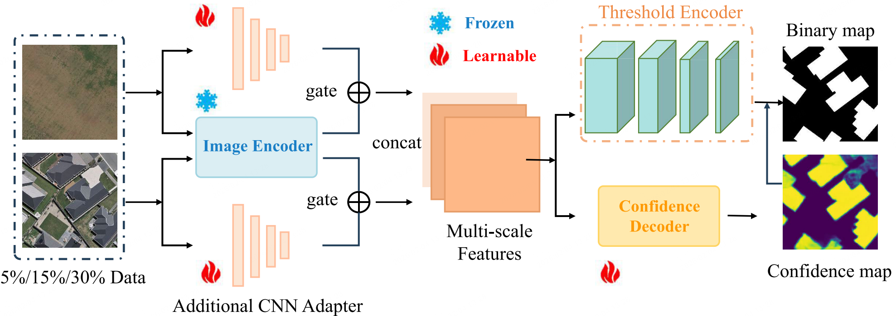

# Meta-CD
Pytorch codes of **Combining SAM with Limited Data for Change Detection in Remote Sensing** [[paper](https://ieeexplore.ieee.org/document/10902491)]




## How to Use (Following [SAM-CD](https://github.com/DingLei14/SAM-CD))
1. Installation
   * Install [FastSAM](https://github.com/CASIA-IVA-Lab/FastSAM) following the instructions.
   * Modify the Ultralytics source files following the instructions at: ['SAM-CD/models/FastSAM/README.md'](https://github.com/ggsDing/SAM-CD/blob/main/models/FastSAM/README.md). 

2. Dataset preparation.
   * Please split the data into training, validation and test sets and organize them as follows:
```
      YOUR_DATA_DIR
      ├── ...
      ├── train
      │   ├── A
      │   ├── B
      │   ├── label
      ├── val
      │   ├── A
      │   ├── B
      │   ├── label
      ├── test
      │   ├── A
      │   ├── B
      │   ├── label
```

   * Find change line 13 in *datasets/Levir_CD.py* (or other data-loading .py files), change `/YOUR_DATA_ROOT/` to your local dataset directory.

1. Training
   
   classic CD training:
   `python train_CD.py`
   
   training CD with the proposed task-agnostic semantic learning:
   `python train_SAM_CD.py`
   
   line 16-45 are the major training args, which can be changed to load different datasets, models and adjust the training settings.

2. Inference and evaluation
   
   inference on test sets: set the chkpt_path and run
   
   `python pred_CD.py`
   
   evaluation of accuracy: set the prediction dir and GT dir, and run
   
   `python eval_CD.py`


## Dataset Download

In the following, we summarize links to some frequently used CD datasets:

* [LEVIR-CD](https://justchenhao.github.io/LEVIR/)
* [WHU-CD](https://study.rsgis.whu.edu.cn/pages/download/) [(baidu)](https://pan.baidu.com/s/1A0_xbV4ZktWCbL3j94CInA?pwd=WHCD )
* [CLCD (Baidu)](https://pan.baidu.com/s/1iZtAq-2_vdqoz1RnRtivng?pwd=CLCD)
* [S2Looking](https://github.com/S2Looking/Dataset)
* [SYSU-CD](https://github.com/liumency/SYSU-CD)


## Acknowledgement
Our code is based on [SAM-CD](https://github.com/DingLei14/SAM-CD).

## Cite Meta-CD

If you find this work useful or interesting, please consider citing the following BibTeX entry.

```
@article{gao2025combining,
  title={Combining SAM With Limited Data for Change Detection in Remote Sensing},
  author={Gao, Junyu and Zhang, Da and Wang, Feiyu and Ning, Lichen and Zhao, Zhiyuan and Li, Xuelong},
  journal={IEEE Transactions on Geoscience and Remote Sensing},
  year={2025},
  publisher={IEEE}
}
```
